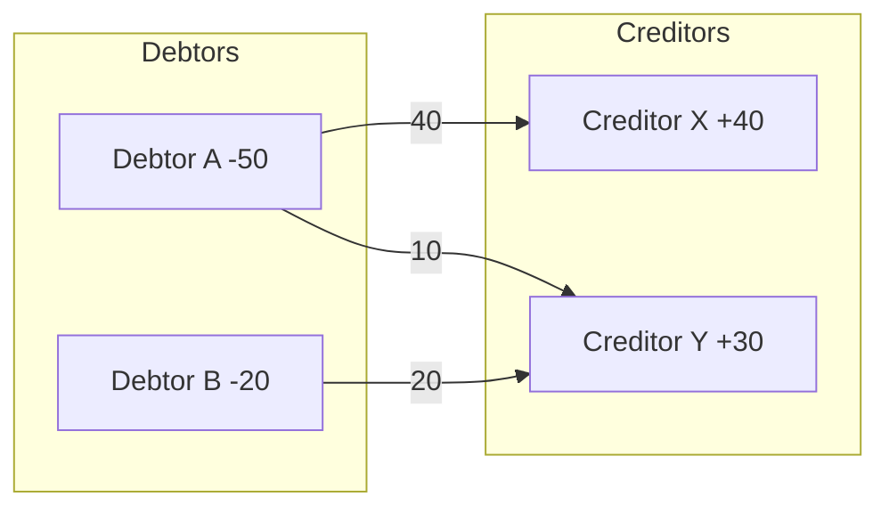
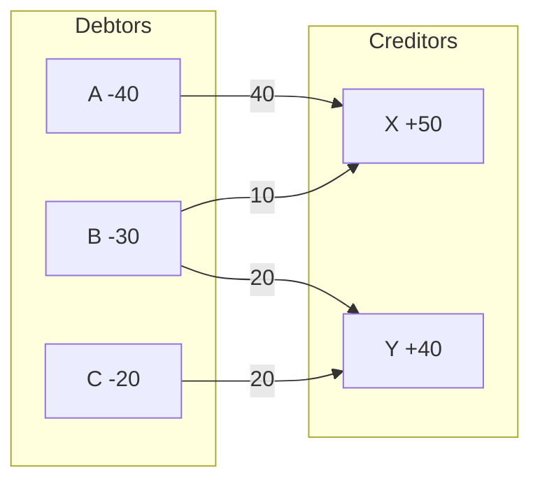
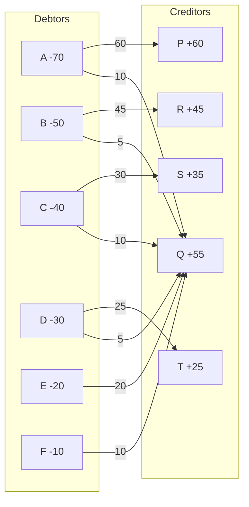

# Split Mint - Backend

Split Mint backend is a Node.js + Express API with MongoDB. It handles auth, groups, participants, expenses, balances, filters, and CSV export.

## Tech stack
- Node.js + Express
- MongoDB + Mongoose
- JWT authentication

## Setup
1. Install dependencies:
   ```bash
   npm install
   ```
2. Create `.env` in `server/` (or copy `.env.example`):
   ```env
   PORT=3000
   MONGO_URI=mongodb://127.0.0.1:27017/splitmint
   JWT_SECRET=change_me
   JWT_EXPIRES_IN=7d
   ```
3. Start the server:
   ```bash
   npm start
   ```
   For auto-reload while editing:
   ```bash
   npm run dev
   ```

The API runs at `http://localhost:3000`.

## Dependencies (npm)
- express
- mongoose
- dotenv
- cors
- morgan
- jsonwebtoken
- bcryptjs
- nodemon (dev)

## Code flow (request -> response)
1. **Route** receives the request (`routes/`).
2. **Middleware** validates JWT if required (`middleware/auth.js`).
3. **Controller** handles input and orchestrates logic (`controllers/`).
4. **Service** does split math / balance math if needed (`services/`).
5. **Repository** reads/writes MongoDB (`repository/`).
6. **Model** defines DB schema (`models/`).
7. **Controller** builds the response and sends JSON.

Example for adding expense:
`routes/groupRoutes.js` -> `controllers/expenseController.js` -> `services/splitService.js` -> `repository/expenseRepo.js` -> `models/Expense.js`

## API overview
Base URL: `http://localhost:3000/api`

### Auth
#### POST `/auth/register`
Register a new user.

Request:
```json
{
  "name": "Abhi",
  "username": "abhi08",
  "email": "abhi@example.com",
  "password": "pass123",
  "avatarColor": "#2f6fed"
}
```

Response:
```json
{
  "token": "<jwt>",
  "user": {
    "id": "665f0a...",
    "name": "Abhi",
    "username": "abhi08",
    "email": "abhi@example.com",
    "avatarSeed": "Abhi-lf5f8-1234",
    "avatarColor": "#2f6fed"
  }
}
```

#### POST `/auth/login`
Login with email + password.

Request:
```json
{
  "email": "abhi@example.com",
  "password": "pass123"
}
```

Response:
```json
{
  "token": "<jwt>",
  "user": {
    "id": "665f0a...",
    "name": "Abhi",
    "username": "abhi08",
    "email": "abhi@example.com",
    "avatarSeed": "Abhi-lf5f8-1234",
    "avatarColor": "#2f6fed"
  }
}
```

### Groups
All group routes need Authorization header: `Bearer <jwt>`.  
Owners and participants can view groups and expenses. Only owners can edit group details or manage participants.

#### GET `/groups`
List all groups for the logged-in user.

Request headers:
```
Authorization: Bearer <jwt>
```

Response:
```json
[
  {
    "_id": "665f1a...",
    "name": "Trip Goa",
    "avatarSeed": "Trip Goa-...",
    "owner": "665f0a...",
    "participants": [
      { "_id": "665f2b...", "name": "Sam", "color": "#ef4444", "avatarSeed": "Sam-..." }
    ]
  }
]
```

#### POST `/groups`
Create a group with up to 3 participants (plus the owner).
Participants must already be registered users and are added by `username`.

Request:
```json
{
  "name": "Trip Goa",
  "participants": [
    { "username": "sam99" },
    { "username": "neha01", "color": "#f97316" }
  ]
}
```

Response:
```json
{
  "_id": "665f1a...",
  "name": "Trip Goa",
  "avatarSeed": "Trip Goa-...",
  "owner": "665f0a...",
  "participants": [
    { "_id": "665f2b...", "name": "Sam", "color": "#ef4444", "avatarSeed": "Sam-..." }
  ]
}
```

#### GET `/groups/:groupId`
Fetch group details.

Response:
```json
{
  "_id": "665f1a...",
  "name": "Trip Goa",
  "avatarSeed": "Trip Goa-...",
  "owner": "665f0a...",
  "participants": [
    { "_id": "665f2b...", "name": "Sam", "color": "#ef4444", "avatarSeed": "Sam-..." }
  ]
}
```

#### PUT `/groups/:groupId`
Update group name.

Request:
```json
{ "name": "Trip Goa 2024" }
```

Response:
```json
{
  "_id": "665f1a...",
  "name": "Trip Goa 2024",
  "avatarSeed": "Trip Goa-...",
  "owner": "665f0a...",
  "participants": []
}
```

#### DELETE `/groups/:groupId`
Deletes the group and all related expenses (cascade delete).

Response:
```json
{ "message": "Group deleted" }
```

#### GET `/groups/:groupId/summary`
Returns totals, balances, and settlement suggestions.

Response:
```json
{
  "totalSpent": 2200,
  "youOwe": 800,
  "youPaid": 1400,
  "balances": {
    "owner": { "id": "owner", "name": "Abhi", "paid": 1400, "owed": 800, "net": 600 },
    "665f2b...": { "id": "665f2b...", "name": "Sam", "paid": 800, "owed": 1400, "net": -600 }
  },
  "settlements": [
    { "from": "665f2b...", "to": "owner", "amount": 600 }
  ]
}
```

#### GET `/groups/:groupId/export`
Download a CSV summary (expenses + balances).

Response:
```
Group,Trip Goa
AvatarSeed,Trip Goa-...

Expenses
Date,Category,Notes,Amount,Paid By,Split Mode,Split Detail
5/20/2024,food_drinks,Cafe near office,900,Abhi,equal,Abhi:450; Sam:450

Balances
Name,Paid,Owed,Net
Abhi,900,450,450
Sam,0,450,-450
```

#### DELETE `/groups/:groupId/leave`
Leave a group as a participant (owners cannot leave).

Response:
```json
{ "message": "Left group" }
```

### Participants
#### POST `/groups/:groupId/participants`
Add a participant.

Request:
```json
{ "username": "riya22", "color": "#ef4444" }
```

Response:
```json
{
  "_id": "665f1a...",
  "name": "Trip Goa",
  "participants": [
    {
      "_id": "665f9c...",
      "userId": "665f0a...",
      "username": "riya22",
      "name": "Riya",
      "color": "#ef4444",
      "avatarSeed": "Riya-..."
    }
  ]
}
```

#### PUT `/groups/:groupId/participants/:participantId`
Edit a participant name/color.

Request:
```json
{ "name": "Riya Sharma", "color": "#8b5cf6" }
```

Response:
```json
{
  "_id": "665f1a...",
  "participants": [
    { "_id": "665f9c...", "name": "Riya Sharma", "color": "#8b5cf6", "avatarSeed": "Riya-..." }
  ]
}
```

#### DELETE `/groups/:groupId/participants/:participantId`
Removes a participant. If linked to expenses, deletion is blocked.

Response (blocked):
```json
{
  "message": "Participant is linked to expenses. Delete or edit those expenses first."
}
```

Response (success):
```json
{
  "_id": "665f1a...",
  "participants": []
}
```

### Expenses
#### GET `/groups/:groupId/expenses`
List expenses with optional filters:
- `category` (one of: food_drinks, grocery, travel, household_bills, shopping, entertainment, others)
- `participantId`
- `startDate`, `endDate`
- `minAmount`, `maxAmount`

Example:
```
GET /groups/:groupId/expenses?category=travel&participantId=owner&startDate=2024-01-01&minAmount=50
```

Response:
```json
[
  {
    "_id": "665f5a...",
    "group": "665f1a...",
    "payerId": "owner",
    "category": "food_drinks",
    "notes": "Cold brew",
    "amount": 120,
    "date": "2024-05-20T00:00:00.000Z",
    "splitMode": "equal",
    "splits": [
      { "participantId": "owner", "amount": 60 },
      { "participantId": "665f2b...", "amount": 60 }
    ]
  }
]
```

#### POST `/groups/:groupId/expenses`
Add an expense.

Equal split request:
```json
{
  "category": "food_drinks",
  "notes": "Cafe near office",
  "amount": 900,
  "date": "2024-05-20",
  "payerId": "owner",
  "splitMode": "equal",
  "participantIds": ["owner", "665f2b..."]
}
```

Response:
```json
{
  "_id": "665f5a...",
  "group": "665f1a...",
  "payerId": "owner",
  "category": "food_drinks",
  "notes": "Cafe near office",
  "amount": 900,
  "date": "2024-05-20T00:00:00.000Z",
  "splitMode": "equal",
  "settledBy": [],
  "splits": [
    { "participantId": "owner", "amount": 450 },
    { "participantId": "665f2b...", "amount": 450 }
  ]
}
```

Custom amount split request:
```json
{
  "category": "travel",
  "notes": "Booked from app",
  "amount": 1200,
  "date": "2024-05-21",
  "payerId": "665f2b...",
  "splitMode": "custom",
  "participantIds": ["owner", "665f2b..."],
  "amounts": [700, 500]
}
```

Response:
```json
{
  "_id": "665f6b...",
  "category": "travel",
  "splitMode": "custom",
  "splits": [
    { "participantId": "owner", "amount": 700 },
    { "participantId": "665f2b...", "amount": 500 }
  ]
}
```

Percentage split request:
```json
{
  "category": "travel",
  "notes": "Airport ride",
  "amount": 500,
  "date": "2024-05-22",
  "payerId": "owner",
  "splitMode": "percentage",
  "participantIds": ["owner", "665f2b..."],
  "percentages": [60, 40]
}
```

Response:
```json
{
  "_id": "665f7c...",
  "category": "travel",
  "splitMode": "percentage",
  "splits": [
    { "participantId": "owner", "amount": 300 },
    { "participantId": "665f2b...", "amount": 200 }
  ]
}
```

#### PUT `/groups/:groupId/expenses/:expenseId`
Update an expense (same payload as POST).

Response:
```json
{
  "_id": "665f5a...",
  "category": "food_drinks",
  "notes": "Changed notes",
  "amount": 950,
  "splitMode": "equal"
}

#### PUT `/groups/:groupId/expenses/:expenseId/settle`
Mark or unmark a participant as settled for that expense.

Request:
```json
{ "participantId": "665f2b..." }
```

Response:
```json
{
  "_id": "665f5a...",
  "settledBy": ["665f2b..."],
  "splitMode": "equal"
}
```
```

#### DELETE `/groups/:groupId/expenses/:expenseId`
Delete an expense.

Response:
```json
{ "message": "Expense deleted" }
```

## Notes
- Each group can have **max 3 participants + the owner**.
- Usernames are unique; registration fails if the username already exists.
- Removing or leaving a group deletes all expenses linked to that participant.
- Balances are rounded to 2 decimals with remainder adjusted to the last participant for consistency.
- Settlements are simplified using a max-heap min-cash-flow strategy.

## Balance simplification (Splitwise-style)
This backend converts many expenses into a small set of transfers so people can settle up with fewer payments.

### Core idea
Every expense creates a directed flow:
- Payer has **positive** net (they are owed money).
- Participants who owe share have **negative** net (they owe money).

After processing all expenses, each person has a single **net** value:
- `net > 0` means the person should receive money.
- `net < 0` means the person should pay money.
- `net = 0` means they are settled.

This transforms the original expense graph into a **bipartite DAG**:
- One side: debtors (only outgoing edges).
- Other side: creditors (only incoming edges).
- No cycles are needed because money always flows from debtors to creditors.

### Algorithm used (min-cash-flow with heaps)
We use a greedy **min-cash-flow** strategy that is widely used in Splitwise-style apps:
1. Compute each user's net balance.
2. Split into two sets:
   - **Debtors**: `amount = abs(net)`
   - **Creditors**: `amount = net`
3. Always match the **largest debtor** with the **largest creditor**:
   - Transfer `min(debtor.amount, creditor.amount)`.
   - If someone still has leftover balance, they go back into their set.

We implement the matching with max-heaps to keep the largest balances available in `O(log n)` time.

### Why this works
- It preserves total balance: sum of all nets is 0.
- Each transfer reduces at least one person to zero, so it finishes quickly.
- The result is a compact settlement set that avoids redundant cycles.

### Complexity
- Building nets: `O(E)` where `E` is number of expense splits.
- Heap operations: `O(P log P)` where `P` is number of participants.
- Total: efficient even for many expenses.

### Example
If nets are:
- A: +70
- B: -50
- C: -20

Then the algorithm outputs:
- B -> A : 50
- C -> A : 20

Only 2 transfers instead of many raw expenses.

## Data modeling and database optimization
This backend uses MongoDB collections and indexes that match real access patterns, keeping reads fast and writes predictable without over-indexing.

### Query patterns and matching indexes
**Users**
- Lookups by `email` and `username` are frequent during login/register.
- `unique` constraints on both fields create indexes automatically, enforcing uniqueness and speeding up lookups.

**Groups**
- List groups by owner: `find({ owner })`
- List groups by participant: `find({ "participants.userId" })` or `find({ "participants.username" })`
- Indexes:
  - `{ owner: 1 }` for owner listings
  - `{ "participants.userId": 1 }` for membership lookups
  - `{ "participants.username": 1 }` for username-based membership lookups

**Expenses**
- Fetch expenses by group with filters and sort by recent:
  - `{ group: 1, date: -1 }` supports the default list/sort.
  - `{ group: 1, category: 1, date: -1 }` supports category filters.
  - `{ group: 1, payerId: 1, date: -1 }` supports payer filters.
- `{ group: 1, "splits.participantId": 1, date: -1 }` supports participant filters and cleanup deletes.

### Why these indexes help
- **Selective filters**: the left-most fields (`group`, `owner`) narrow quickly.
- **Sorted reads**: `date: -1` avoids in-memory sorts for recent-first pages.
- **Fast deletes**: cascade deletes by group or participant hit indexed paths.

### Data model at a glance
The model is normalized at the user/group level and denormalized where it speeds up reads:
- **Users** are stored once and referenced by `_id` in groups.
- **Groups** embed participants so group reads avoid extra joins.
- **Expenses** store payer and splits with participant ids to keep expense reads single-collection.

This design avoids expensive multi-collection joins for the hottest endpoints:
- Listing groups and participants is a single `Group` read.
- Listing expenses is a single `Expense` read with filters.
- Summary calculations use the expenses list and do not require extra user lookups beyond the owner.

### Read/write trade-offs
- Embedding participants in groups makes reads fast, but updates require touching the group document.
- Storing `payerId` and `splits.participantId` as strings keeps IDs consistent with the API and simplifies queries.
- The index set is minimal and aligned with the actual API filters to avoid write amplification.

### How queries map to indexes (examples)
- **List groups you own**
  - Query: `Group.find({ owner: userId })`
  - Index: `{ owner: 1 }`
  - Benefit: quick scan of only your groups.
- **List groups where you're a participant**
  - Query: `Group.find({ "participants.userId": userId })`
  - Index: `{ "participants.userId": 1 }`
  - Benefit: avoids full collection scan as groups grow.
- **List expenses for a group (latest first)**
  - Query: `Expense.find({ group }).sort({ date: -1 })`
  - Index: `{ group: 1, date: -1 }`
  - Benefit: uses index order for pagination and recent views.
- **Filter expenses by category**
  - Query: `Expense.find({ group, category }).sort({ date: -1 })`
  - Index: `{ group: 1, category: 1, date: -1 }`
- **Filter expenses by participant involvement**
  - Query: `Expense.find({ group, $or: [ { payerId }, { "splits.participantId": id } ] })`
  - Index: `{ group: 1, payerId: 1, date: -1 }` and `{ group: 1, "splits.participantId": 1, date: -1 }`

### Data integrity and constraints
- Usernames and emails are unique at the database level.
- Group participant entries store both `userId` and `username` to allow fast lookups and resilient reads.
- Expenses validate `category` and `splitMode` via schema enums.

### Growth considerations
- Large expense lists remain efficient because every query is scoped by `group`.
- If groups grow beyond the current 3-participant limit, the index strategy still holds.
- For very large datasets, consider adding pagination parameters to expense endpoints to limit payload sizes.

### Operational note
When the app starts, Mongoose ensures indexes exist. On large datasets, create them once during maintenance windows to avoid write slowdowns.

## Balance management visualization
The settlement process can be seen as a flow graph from debtors to creditors after all expenses are reduced to net balances.

### Mermaid (rendered graph)


### ASCII (plain text)
```
Debtors (pay)                 Creditors (receive)
-----------                   -------------------
Debtor A -50  ---- 40 ---->   Creditor X +40
              ---- 10 ---->   Creditor Y +30
Debtor B -20  ---- 20 ---->   Creditor Y +30
```

The max-heap min-cash-flow algorithm repeatedly connects the largest debtor to the largest creditor,
shrinking both until one side is empty. This produces a compact set of transfers that fully settles
the group.

### Algorithm explained with diagram
We model the settlement as a bipartite flow graph:
- Left side: debtors (negative net).
- Right side: creditors (positive net).
- Edges represent payments; each edge reduces both sides.

#### Diagram: flow graph to settlements


#### Diagram: larger group example


#### Detailed walkthrough with comments (large example)
Net balances:
- Creditors: P +60, Q +55, R +45, S +35, T +25
- Debtors: A -70, B -50, C -40, D -30, E -20, F -10

We always pick the largest debtor and largest creditor from the heaps.

Step 1: A(70) -> P(60) = 60
- Comment: P is fully settled; A still owes 10.

Step 2: A(10) -> Q(55) = 10
- Comment: A is settled; Q still needs 45.

Step 3: B(50) -> R(45) = 45
- Comment: R is settled; B still owes 5.

Step 4: B(5) -> Q(45) = 5
- Comment: B is settled; Q still needs 40.

Step 5: C(40) -> S(35) = 35
- Comment: S is settled; C still owes 5.

Step 6: C(5) -> Q(40) = 5
- Comment: C is settled; Q still needs 35.

Step 7: D(30) -> T(25) = 25
- Comment: T is settled; D still owes 5.

Step 8: D(5) -> Q(35) = 5
- Comment: D is settled; Q still needs 30.

Step 9: E(20) -> Q(30) = 20
- Comment: E is settled; Q still needs 10.

Step 10: F(10) -> Q(10) = 10
- Comment: Q is settled; F is settled.

Resulting transfers:
- A -> P : 60
- A -> Q : 10
- B -> R : 45
- B -> Q : 5
- C -> S : 35
- C -> Q : 5
- D -> T : 25
- D -> Q : 5
- E -> Q : 20
- F -> Q : 10

Why this is compact:
- Each step zeroes out at least one person.
- Total transfers are bounded by debtors + creditors - 1.

#### Step-by-step example (5 participants)
Net balances after all expenses:
- X: +50
- Y: +40
- A: -40
- B: -30
- C: -20

We maintain two max-heaps: one for debtors by amount, one for creditors by amount.

Steps:
1. Match A(40) with X(50): pay 40
   - A becomes 0, X becomes +10
2. Match B(30) with Y(40): pay 30
   - B becomes 0, Y becomes +10
3. Match C(20) with X(10): pay 10
   - C becomes -10, X becomes 0
4. Match C(10) with Y(10): pay 10
   - C becomes 0, Y becomes 0

Final settlements:
- A -> X : 40
- B -> Y : 30
- C -> X : 10
- C -> Y : 10

Why this algorithm is correct:
- **Conservation**: total net sum is 0, so all debts can be matched to credits.
- **Progress**: each transfer zeros at least one node, guaranteeing termination.
- **No cycles**: edges only go from debtors to creditors, forming a DAG.

#### Pseudocode
```text
build debtors max-heap from net < 0 (store abs(net))
build creditors max-heap from net > 0
while both heaps not empty:
  d = pop largest debtor
  c = pop largest creditor
  pay = min(d.amount, c.amount)
  add settlement (d.id -> c.id, pay)
  if d.amount > pay: push (d.id, d.amount - pay)
  if c.amount > pay: push (c.id, c.amount - pay)
```

Net balances after all expenses:
- A: +60
- B: +30
- C: -20
- D: -40
- E: -30

Interpretation:
- Creditors: A(+60), B(+30)
- Debtors: D(-40), E(-30), C(-20)

We always match the largest debtor with the largest creditor:
1. D(40) -> A(60): pay 40
   - D becomes 0, A becomes +20
2. E(30) -> B(30): pay 30
   - E becomes 0, B becomes 0
3. C(20) -> A(20): pay 20
   - C becomes 0, A becomes 0

Resulting transfers:
- D -> A : 40
- E -> B : 30
- C -> A : 20

Why it works:
- Each transfer clears at least one person (debtor or creditor).
- Total sum stays 0, so it always ends.
- This avoids cycles and keeps the settlement list short.

## Example flow
1. Register user -> get JWT.
2. Create group with participants.
3. Add expenses with equal/custom/percentage splits.
4. Use `/summary` to show totals and net balances.

## Migration (older groups)
If you created groups before usernames/userIds were enforced in participants, run:
```bash
node scripts/backfillParticipants.js
```
This backfills missing `userId` / `username` fields on group participants.
